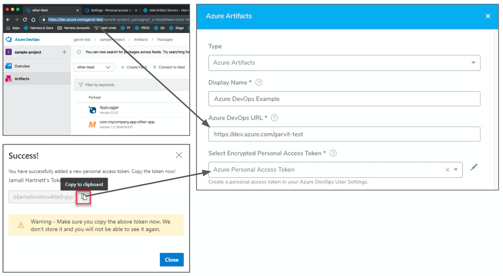

Azure Artifacts package feeds are added to Harness as Azure Artifacts Servers.

The package types supported currently are NuGet and Maven.In this topic:

* [Before You Begin](#before_you_begin)
* [Visual Summary](#visual_summary)
* [Step 1: Select Azure DevOps Artifact Server](#step_1_select_azure_dev_ops_artifact_server)
* [Step 2: Display Name](#step_2_display_name)
* [Step 3: Azure DevOps URL](#step_3_azure_dev_ops_url)
* [Step 4: Personal Access Token](#step_4_personal_access_token)
* [Next Steps](#next_steps)

### Before You Begin

* See [Harness Key Concepts](https://docs.harness.io/article/4o7oqwih6h-harness-key-concepts).

### Visual Summary

Here's a summary of Azure DevOps Artifact Server connection setup.

The Azure Artifacts connection has the following settings.

### Step 1: Select Azure DevOps Artifact Server

To connect to an artifact server, do the following:

1. Click **Setup**.
2. Click **Connectors**.
3. Click **Artifact Servers**.
4. Click **Add Artifact Server**.
5. In **Type**, click **Azure Artifacts**.

### Step 2: Display Name

Enter a name for the Artifact Server. This is the name you will use to identify this connection when adding an Artifact Source to a Harness Service.

### Step 3: Azure DevOps URL

This is the URL in your browser when you are in the Azure DevOps *organization* containing the projects and feed(s) you want to use.

For example, in this URL, `https://dev.azure.com/garvit-test/sample-project/_packaging?_a=feed&feed=other-feed`, you only need to add `https://dev.azure.com/garvit-test` in the **Azure DevOps URL** setting.

### Step 4: Personal Access Token

Create a Personal Access token as described in [Authenticate access with personal access tokens](https://docs.microsoft.com/en-us/azure/devops/organizations/accounts/use-personal-access-tokens-to-authenticate?view=azure-devops&tabs=preview-page) from Azure.

Next, copy the token and paste it in the Harness Encrypted Text secret you use for **Select Encrypted Personal Access Token**.

The Personal Access Token must have the **Read** permission in **Packaging**.

Click **Submit**.

Once you have added the Azure DevOps Artifact Server, you can use Azure DevOps Artifact feeds as Artifact Sources in Harness Services. See [Add an Azure DevOps Artifact Source](../../../continuous-delivery/model-cd-pipeline/setup-services/add-an-azure-dev-ops-artifact-source.md).

### Next Steps

* See [Azure Deployments Overview](../../../continuous-delivery/azure-deployments/aks-howtos/azure-deployments-overview.md).

