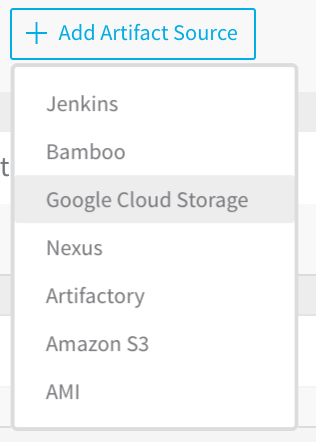

Harness integrates with many different types of repositories and artifact providers. We call these Artifact Servers, and they help Harness you pull your artifacts during deployments.

In this topic:

* [Before You Begin](#before_you_begin)
* [Review: Artifact Sizes and Limitations](#review_artifact_sizes_and_limitations)
* [Review: Add AWS S3 and Google Cloud Storage Artifact Servers](#review_add_aws_s3_and_google_cloud_storage_artifact_servers)
* [Review: Anonymous Access](#review_anonymous_access)
* [Add Platform-Specific Artifact Servers](#add_platform_specific_artifact_servers)

### Before You Begin

* See [Harness Key Concepts](https://docs.harness.io/article/4o7oqwih6h-harness-key-concepts).

### Review: Artifact Sizes and Limitations

Most artifacts are set up in Harness Services using only their metadata, but in some cases, like traditional deployments using ZIP, JAR, or WAR files, the files are uploaded to the Harness cloud.

Harness has a limit of a 1GB file upload. However, Harness directly streams from the artifact server if the file size is larger (even larger than 25GB).

For artifacts larger than 1GB, use the **Metadata Only** option in the Harness Service **Artifact Source** settings.

### Review: Add AWS S3 and Google Cloud Storage Artifact Servers

Amazon AWS and Google Cloud Platform are added to Harness as **Cloud Providers**, but they may also be used as artifact servers in a Harness Service.

You simply add them as Cloud Providers, and then when you are adding an artifact in a Harness Service, the AWS S3 and Google Cloud Storage options will be available.

Here is what the Artifact Source list looks like in a Harness service when AWS S3 and Google Cloud Storage have been as added as Cloud Providers:

For information on how to add AWS and GCP as Cloud Providers, see [Add Cloud Providers](cloud-providers.md).

### Review: Anonymous Access

The following Artifact Servers support anonymous access for Docker images:

* Docker Registry
* Nexus
* Artifactory

If you are using anonymous access to obtain the artifact for your Service, you should ensure that host running the Harness Delegate has view and read permissions and that the container specification for the deployment platform you are using is set up for anonymous access. For example:

* **Kubernetes** - Ensure that `imagePullSecrets` is removed from the container specification. For more information, see [Pull an Image from a Private Registry for Kubernetes](../../../continuous-delivery/kubernetes-deployments/pull-an-image-from-a-private-registry-for-kubernetes.md). For Harness version 1 implementation of Kubernetes, `imagePullSecrets` is added by default. For version 2, `imagePullSecrets` is not added by default.
* **ECS** - By default, ECS uses anonymous access. To use a private registry, you must use the RepositoryCredentials property type in the Container Specification. For more information, see [Using Private Docker Registry Authentication](../../../continuous-delivery/aws-deployments/ecs-deployment/ecs-services.md#using-private-docker-registry-authentication).

### Add Platform-Specific Artifact Servers

See the following topics for platform-specific Artifact Servers:

* [Add Azure DevOps Artifact Servers](add-azure-dev-ops-artifact-servers.md)
* [Add Jenkins Artifact Servers](add-jenkins-artifact-servers.md)
* [Add Bamboo Artifact Servers](add-bamboo-artifact-servers.md)
* [Add Docker Registry Artifact Servers](add-docker-registry-artifact-servers.md)
* [Add Nexus Artifact Servers](add-nexus-artifact-servers.md)
* [Add Artifactory Artifact Servers](add-artifactory-servers.md)
* [Add Samba Server Artifact Servers](add-smb-artifact-servers.md)
* [Add SFTP Artifact Servers](add-sftp-artifact-servers.md)
* [Add Helm Repository Artifact Servers](add-helm-repository-servers.md)

You can also use a custom artifact source in a Harness Service that queries your artifact server via its API. See [Using Custom Artifact Sources](../../../continuous-delivery/model-cd-pipeline/setup-services/custom-artifact-source.md).

