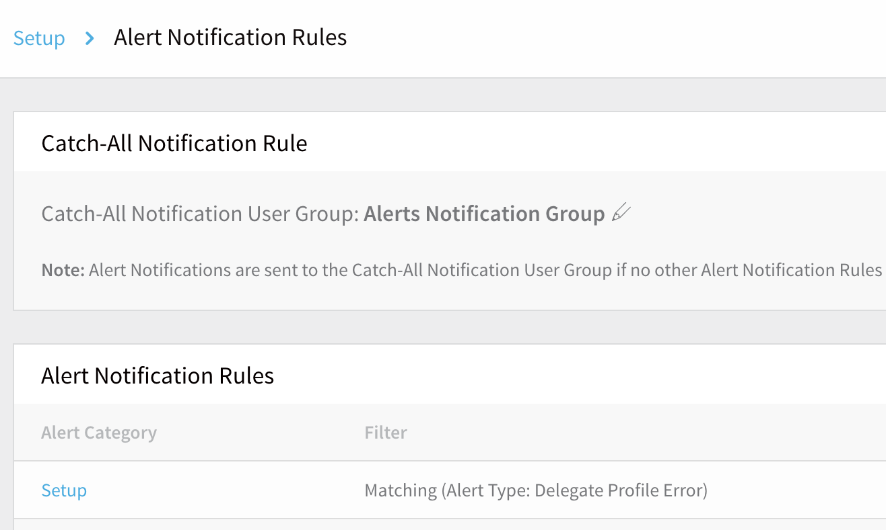
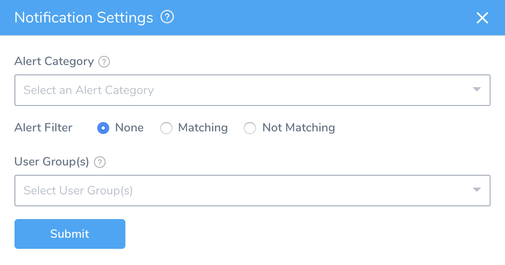
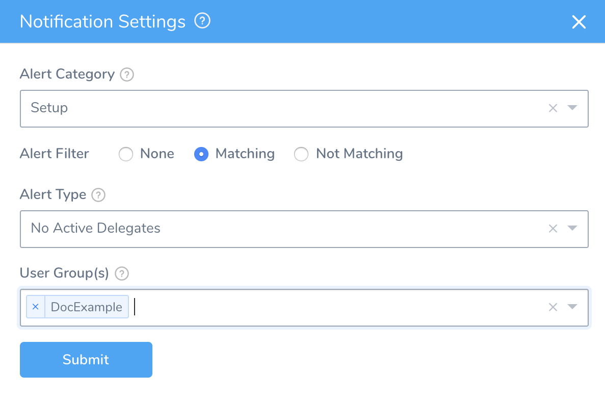
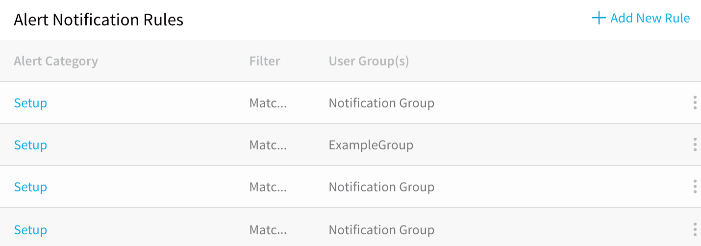

The Alert Notification Rules determine which alerts to send to specific User Groups, such as an alert that a Harness Delegate is down. This topic explains the process to set up notification rules and alerts.

In this topic:

* [Before You Begin](#before_you_begin)
* [Step 1: Set up Alert Notification Rules](#setup_rules)
* [Step 2: Set up Alerts](#setup_alerts)
* [Review: Alert Thresholds](#alert_thresholds)
* [Step 4: Set up Workflow and Phase Notifications](#worklflow_phase)

### Before You Begin

* [Harness Key Concepts](https://docs.harness.io/article/4o7oqwih6h-harness-key-concepts)
* [Manage User Notifications](notification-groups.md)

### Step 1: Set up Alert Notification Rules

To set up an Alert Notification Rule, do the following:

1. In Harness Manager, click **Setup**, and then click **Alert Notification Rules**. The **Alert Notification Rules** settings appear.

The options here are outlined in the following sections:

* [Alert Notification Status Toggle](#alert_notification_status_toggle)
* [Catch-All Notification Rule Setup](#catch_all_notification_rule)
* [Alert Notification Rules Setup](#alert_notification_rules_2)

#### Alert Notification Status Toggle

The **Alert Notification Status** slider at upper right is a global panic button for situations where your users are receiving too-frequent notifications. By sliding this to its **OFF** position, you restrict notifications to Harness Manager's adjacent bell-shaped **Alerts** indicator, only. This prevents notifications from being forwarded to any of the channels configured below.

While set to **OFF**, this Status toggle will suppress notifications to all User Groups—those configured under both the [Catch-All Notification Rule](#catch_all_notification_rule) and [Alert Notification Rules](#alert_notification_rules_2) sections.
#### Catch-All Notification Rule Setup

In **Catch-All Notification Rule**, you specify the User Groups to use as the Catch-All Notification Groups, and the alert rules for those Groups. Whatever rules are not covered by the parallel **Alert Notification Rules** section are applied to the User Groups in the **Catch-All Notification Rule** section.

For example, if a specific rule is not applied to any User Group in the **Alert Notification Rules** section, then that alert is sent to the User Groups set up in the **Catch-All Notification Rule** section.

At least one **Catch-All Notification Rule** User Group is required. By default, the Account Administrator User Group is used.To set up a Catch-All Notification Rule User Group, do the following:

1. In the **Alert Notification Rules** page, click the pencil icon next to the **Catch-All Notification User Group**. The **Notification Settings** dialog appears.

1. In **User Group(s)**, select the User Groups to set as the **Catch-All Notification User Groups**.
2. Click **SUBMIT**. The groups you selected are listed.

For the Catch-All group, the **Notification Settings** dialog's **Alert Category** selection is locked to **All** alerts.

#### Alert Notification Rules Setup

The Alert Notification Rules determine how alerts are routed to User Groups.

To begin defining an alert notification rule, do the following:

1. In the **Alert Notification Rules** section, click **Add New Rule**. The **Notification Settings** dialog appears.

1. Set the **Alert Filter** to either **Matching** or **Not Matching**, depending on the type of rule you want to create.

1. In **Alert Category**, select a category.

The dialog now displays different controls, depending on which category you selected:

* [Setup](#setup-alerts) – These alerts are triggered by events within Harness.
* [24/7 Service Guard](#24-7-service-guard-alerts) – These alerts are triggered by Harness' analysis of data from your configured third-party monitoring and verification tools.

### Step 2: Set up Alerts

Selecting an **Alert Category** of **Setup** keeps the **Notification Settings** dialog compact. To finish defining your notification rule:

1. In **Alert Type**, select the specific alert for this rule.
2. In **User Groups**, select the User Groups that will receive the alert.  
  
When you are done, the dialog will look something like this:

1. Click **SUBMIT**. The new rule is displayed.

### Step 3: Set up 24/7 Service Guard Alerts

Setting the **Alert Category** to **24/7 Service Guard** expands the **Notification Settings** dialog. Use the additional controls here to fine-tune how this rule will send alerts to your User Groups. (For details, see [Alert Thresholds](#thresholds).) To continue defining the rule:

Set the **Alert Type** to **24/7 Service Guard**.

1. Leave the **Application** multi-select drop-down set to **All**, or limit this rule by selecting one or more specific Harness Applications.
2. Leave the **Environment** drop-down set to **All**, or limit this rule by selecting one or more specific Harness Environments.
3. If you have modified the **Application** and/or **Environment** defaults, select corresponding **Service Verification(s)**.
4. Drag the **Alert Threshold** slider to set the minimum severity level for User Groups to receive these alerts. For details, see [Alert Thresholds](#thresholds).
5. Select the **User Groups(s)** to receive the alert.  
When you are done, the dialog will look something like this:

1. Click **SUBMIT**. The new rule is displayed.

### Review: Alert Thresholds

When you create a 24/7 Service Guard alert rule, you use the **Alert Threshold** slider to define a severity level. When Harness determines that this severity threshold has been met or exceeded, it will send alerts to the User Group(s) you configure.

You can create multiple rules to route the same Alert Type to different User Groups, depending on severity. For example, you might set three rules, using the following thresholds on the slider's 0–1.0 scale:

* 0.2+: Send to developers (via Slack, email, etc.).
* 0.5+: Send to DevOps.
* 0.8+: Send to engineering managers

##### Thresholds and Overall Risk Level

The slider's scale represents Harness' analyzed risk level, based on metrics, transaction history, and machine-learning models. While third-party Verification Providers' alerts are typically based on static rules, Harness' alerts are dynamic. Over time, Harness will escalate or decrease alerts, as we observe anomalies, regressions, and other factors.

To set the Overall Risk Level at which Harness originally *triggers* alerts—based on our analysis of data from your third-party Verification Providers—each provider's **Alert Notification** dialog provides a similar **Alert Threshold** slider. For details, see [24/7 Service Guard Overview](../../../continuous-delivery/continuous-verification/continuous-verification-overview/concepts-cv/24-7-service-guard-overview.md).

#### Alert Examples

Here is an example of an alert in Slack:

Here is an example of an alert in email:

### Step 4: Set up Workflow and Phase Notifications

Workflow notifications are set up in the Workflow **Notification Strategy** settings. For information on setting the Workflow Notification Strategy, see [Notification Strategy](../../../continuous-delivery/model-cd-pipeline/workflows/workflow-configuration.md#notification-strategy).

