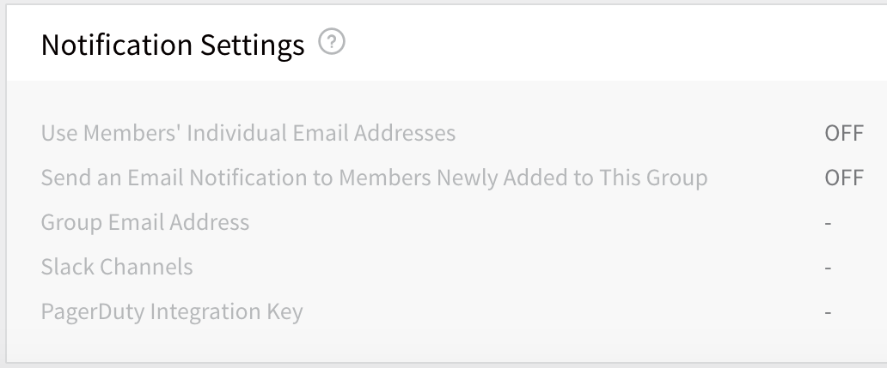
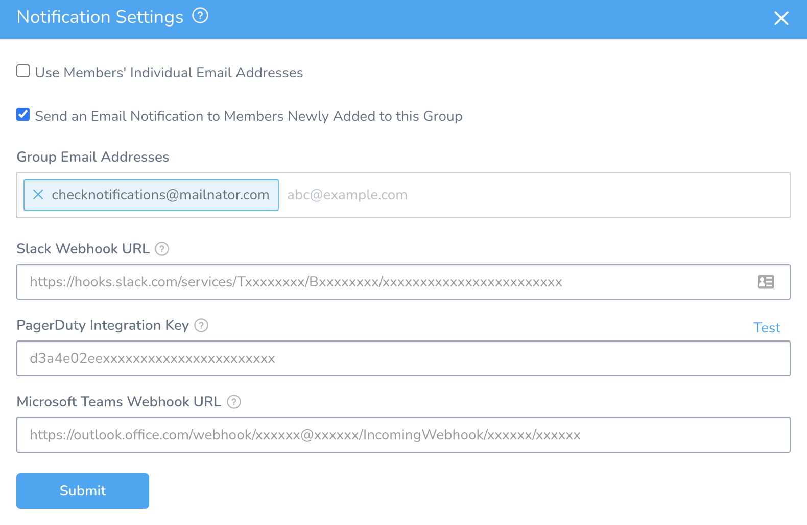

Harness provides granular control of notifications, allowing you to control alert conditions, users, and groups across your account and in individual Workflows. This topic describes the major notification features and explains the procedure to add notification settings for user groups.

### Before You Begin

* See [Harness Key Concepts](https://docs.harness.io/article/4o7oqwih6h-harness-key-concepts).

### Video Summary

The following video shows how to set up notifications using Harness PagerDuty integration as an example.

<docvideo src="https://www.youtube.com/embed/YDyNj9EYiNk" />

### Review: Major Notification Features

There are three major notification features:

* **Notification Settings for User Groups** – Set the notification channels for User Group members. These include group or individual email addresses, and Slack channels. When User Groups are used in an Alert Notification Rule or in a Workflow Notification Strategy, these channels will be used to notify the group members.
* **Alert Notification Rules** – Set which types of alerts are sent to different User Groups. You can also set up a default Catch-All Notification User Group to receive all alerts.
* **Workflows Notification Strategy** – Set notification conditions in a Workflow or Workflow Phase, and the User Groups that need to be notified when these conditions are met.

### Step: Add Notification Settings for User Groups

You can add notification settings to Harness User Groups, including group email addresses and Slack channels. When the User Group is assigned an Alert Notification Rule, or added to a Workflow Notification Strategy, the channels you set here will be used to notify them.

To add notification settings to Harness User Groups, do the following:

1. In Harness Manager, click **Continuous Security**, and then click **Access Management**.
2. In **Access Management**, click **User Groups**.
3. Click the name of an existing User Group, or create a new User Group with the steps in [Managing Users and Groups (RBAC)](../../security/access-management-howtos/users-and-permissions.md).
4. Locate the **Notification Settings** section.
5. Click the More Options **⋮** menu, then click **Edit**. The **Notification Settings** dialog appears.

1. Configure the following notification settings and click **SUBMIT**.
* **Use Members' Individual Email Addresses** – Enable this setting to have notifications sent to the individual email addresses of the group's configured Member Users.
* **Send an Email Notification to Members Newly Added to This Group** – Enable this setting to notify new members when they're added to the group.
* **Group Email Addresses** – Enter any group email addresses where Harness can send notifications. The **Group Email Addresses** are always used, regardless of whether **Use Members' Individual Email Addresses** is enabled.
* **Slack Channel Name** – Enter the name of a Slack channel where Harness can post notifications. You do not need to enter the exact name, as the **Slack Webhook URL** will point to the exact channel.
* **Slack Webhook URL** – Enter the Slack channel Incoming Webhook URL.  
See [Send Notifications Using Slack](send-notification-using-slack.md).  
For steps on obtaining a Slack channel Incoming Webhook, see [Incoming Webhooks](https://api.slack.com/incoming-webhooks) from Slack.
* **PagerDuty Integration Key** – Enter the key for a PagerDuty Account/Service to which Harness can send notifications. You can copy/paste this key from PagerDuty's **Configuration** > **Services** > **Service Details** dialog > **Integrations** tab, as shown below. (For details, see PagerDuty's documentation on [Creating Integrations](https://support.pagerduty.com/docs/services-and-integrations).)

Once you click **SUBMIT**, the **Notification Settings** appear in the User Group page.

### Next Steps

* [Manage Alert Notifications](manage-alert-notifications.md)

