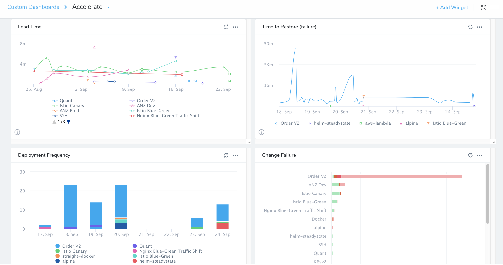
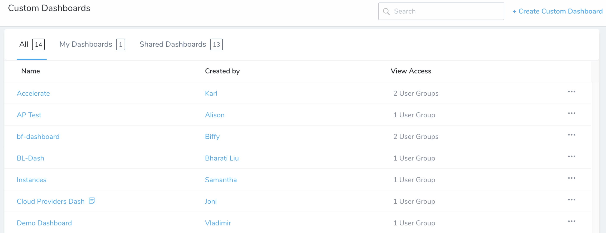
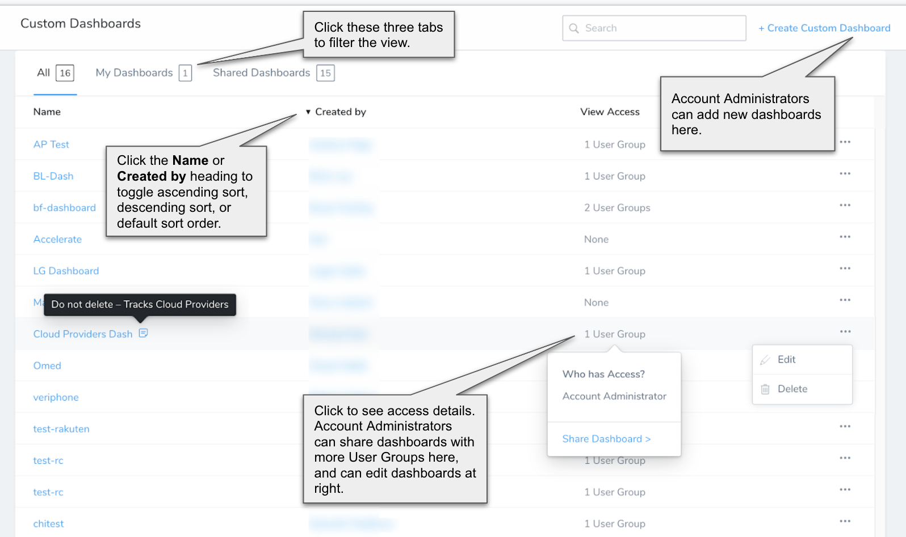

Custom Dashboards provide a toolbox for building your own visual interface around Harness data using flexible filtering and criteria. By creating and fine-tuning visualizations that slice and dice your data, you can identify and optimize:

* Development and deployment velocity
* Bottlenecks
* Rollback durations and other useful metrics

In this topic:

* [Overview of Custom Dashboards](#overview_of_custom_dashboards)
* [RBAC and Dashboards](#rbac_and_dashboards)
* [Groups and Permissions for Custom Dashboard Management](#groups_and_permissions_for_custom_dashboard_management)
* [Navigate Through Custom Dashboards](#navigate_through_custom_dashboards)
* [Next Steps](#next_steps)

### Overview of Custom Dashboards

Custom Dashboards expand on Harness Manager's default [Main and Services Dashboards](main-and-services-dashboards.md). They enable you to visualize and prioritize the deployment and related data that matters to you in flexible display formats. Custom Dashboards provide the following benefits:

* Each authorized Harness user has the option to build multiple dashboards for different reporting purposes.
* You can create each dashboard around Harness’ rich set of setup, runtime, and instance data.
* You can insert Harness' [Primary Widgets](primary-widgets.md) or build your own [Custom Widgets](custom-widgets.md). Primary Widgets display basic DevOps metrics like deployment frequency, lead time to production, mean time to restore, and change failure rate. You can further refine all Widgets to meet your needs.
* Once you've placed your Widgets, simply drag to resize or rearrange them in this visual interface. Custom Dashboards remain editable when they're reopened.
* You can choose to share each dashboard with one or more Harness [User Groups](../security/access-management-howtos/users-and-permissions.md).

### RBAC and Dashboards

[Harness RBAC](../security/access-management-howtos/users-and-permissions.md) is not applied to:

* **Statistical data**—Statistical data means Custom Dashboard graphs displaying data points.  
  
Statistical data is not filtered using [Harness RBAC](../security/access-management-howtos/users-and-permissions.md) if the dashboard is shared with a user.

Harness RBAC is applied to two areas of Custom Dashboards:

* **Dashboard management**—This is the creation, updating, and deleting of dashboards.
* **Execution details**—This is what is displayed when a dashboard viewer clicks a data point in a graph.

#### RBAC on Statistics vs Details

Any viewer has permission to view graphs (statistics) on dashboards shared with them, but only permissions to view the details of the Harness entities (Applications, Services, Environments, deployments, etc) that they have Read permissions for.

### Groups and Permissions for Custom Dashboard Management

A Harness user's interaction with Custom Dashboards is role-based. Options depend on their membership in a Harness User Group with specific Account Permissions.

To create and manage Custom Dashboards, your Harness User Group must have the following Account Permissions:

* Create Custom Dashboards
* Manage Custom Dashboards

Without these permissions, you can still view and operate on a dashboard that has been [shared with you](sharing.md).

For more information, see [Manage Groups and Permissions](custom-dashboards.md#manage-groups-and-permissions-for-custom-dashboards).

### Navigate Through Custom Dashboards

Once you have one or more Custom Dashboards available to you, the **Custom Dashboards** page lists them as the following:

If you are not an Account Administrator, you will see only Custom Dashboards that have been shared with your User Groups.

#### List View

This list view provides the following controls:

#### Detailed View

To view a Custom Dashboard, click its name in the list view's **Name** column.

### Next Steps

* [Primary Widgets](primary-widgets.md)
* [Custom Widgets](custom-widgets.md)
* [Filters, Groups, and Tags in Primary and Custom Widgets](filters-groups-and-tags-in-custom-dashboard-widgets.md)
* [Completed Custom Dashboards](put-all-together-completed-custom-dashboard.md)
* [Create and Manage Custom Dashboards](create-and-manage-dashboards.md)
* [Add and Configure Primary Widgets](add-and-configure-primary-widgets.md)
* [Add and Configure Custom Widgets](configure-custom-widgets.md)

