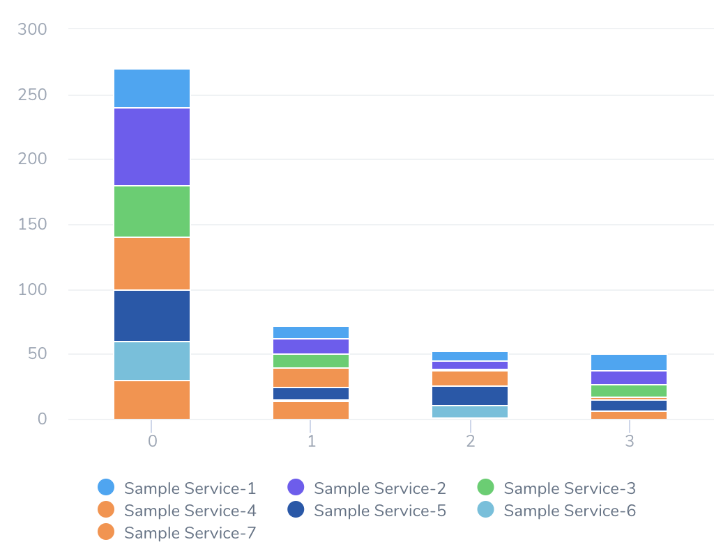
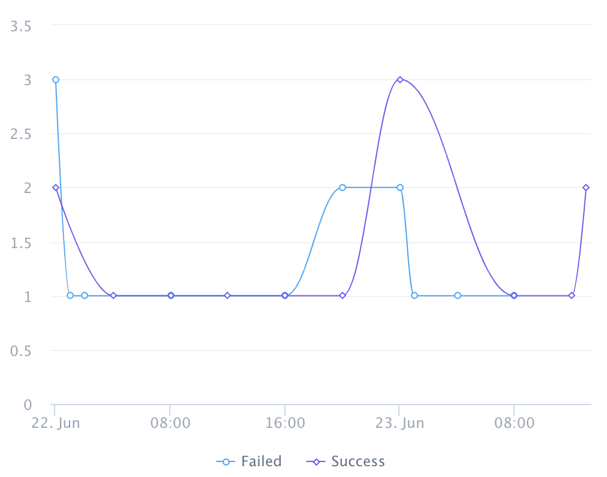

Custom Widgets offer less predefined structure than Primary Widgets but offers more flexibility. When configuring Custom Widgets:

* First, you select a principal Harness entity that you want to analyze, such as, Deployments, Instances, Services, etc.
* Next, select a visualization type, such as a bar chart, line chart, etc.
* Finally configure details, including visual formatting, time range, groupings, and additional filters.

In this topic:

* [Before You Begin](custom-widgets.md#undefined)
* [Custom Widget Types](custom-widgets.md#custom-widget-types)
* [Visualization Types](custom-widgets.md#visualization-types)
* [Next Steps](custom-widgets.md#next-steps)

### Before You Begin

* [Custom Dashboards](custom-dashboards.md)
* [Primary Widgets](primary-widgets.md)
* [Filters, Groups, and Tags in Primary and Custom Widgets](filters-groups-and-tags-in-custom-dashboard-widgets.md)

### Custom Widget Types

The following entities are available at the top level. Harness considers each to be a Custom Widget type:

|  |  |
| --- | --- |
| * Deployments
* Instances
* Services
* Environments
* Workflows
 |  * Pipelines
* Triggers
* Applications
* Cloud Providers
* Connectors
 |

### Visualization Types

If you're a [non-Administrator](#non_administrators), your access to the detailed data and settings behind the visualizations is filtered by your User Group memberships and permissions.Under each Custom Widget type, a row of buttons enables you to select a supported visualization type. You'll see some or all of these options, depending on which entity you're selecting:

|  |  |  |  |  |
| --- | --- | --- | --- | --- |
|  |  |  |  |  |
| Donut Chart | Bar Chart | Line Chart | Area Chart | Aggregate Value |

#### Donut Chart

When displaying Deployments as a donut chart, if you **Group By** a granular entity (such as Services, Environments, or Cloud Providers) or Tag, the displayed count can increase. This is because the display now includes the count for these entities or Tags.

#### Bar Chart

Compared to a donut chart, a bar chart provides more ways to define and display your data. Using the added **Second Group By** option, you can display a time series, or you can plot an X/Y relationship among two entities or Tags.

#### Line Chart and Area Chart

For this visualization type, the **Second Group By** setting must always be a time interval, building a time series. Use the **Group By** field to break down the displayed totals by any entity or Tag you want.

#### Area Chart

For this visualization type, the **Second Group By** setting must always be a time interval, building a time series. Use the **Group By** field to break down the displayed totals by any entity or Tag you want.

#### Aggregate Value

This visualization type **(**selectable with a "**21**” icon**)** simply displays a Total Count. It offers no **Group By** options and no clickable chart segments, but users can click its **View Details** link to pass through to the Harness Manager details aggregated in the total.

### Next Steps

* [Create and Manage Custom Dashboards](create-and-manage-dashboards.md)
* [Add and Configure Primary Widgets](add-and-configure-primary-widgets.md)
* [Add and Configure Custom Widgets](configure-custom-widgets.md)

