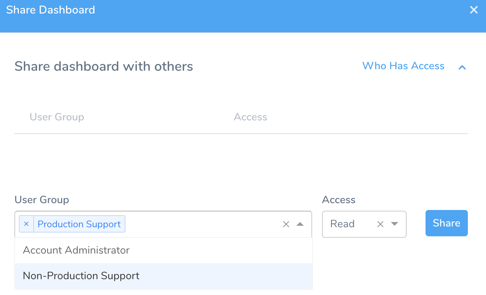
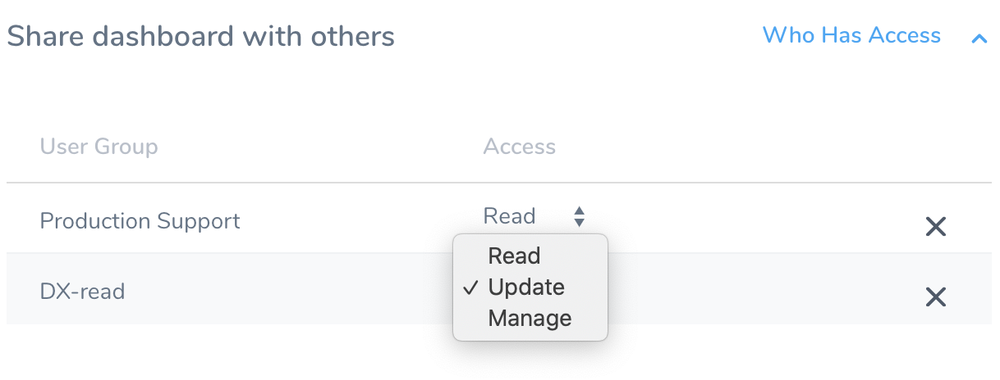

By default, when you create a Custom Dashboard, only you and members of the Account Administrators User Group have full permissions on it. But you might want to give different permissions to other User Groups.

You can share Custom Dashboards with user group(s) and manage their access permissions. Managing permissions allows you to fine-tune access to the Custom Dashboard.

In this topic:

* [Before You Begin](sharing.md#before-you-begin)
* [Step: Share Custom Dashboards](sharing.md#step-share-custom-dashboards)
* [Notes](sharing.md#notes)

### Before You Begin

* [Custom Dashboards](custom-dashboards.md)
* [Managing Users and Groups (RBAC)](../security/access-management-howtos/users-and-permissions.md)

### Step: Share Custom Dashboards

1. In **Custom Dashboards**, select the dashboard that you want to share and click **Manage**.

1. In **Share Dashboard** in User Group, select the Harness **User Group(s)** you want to share this dashboard with.
2. In **Access,** select the access for the user group(s). You can select **Read**, **Update**, or **Manage**. When you are done, click **Share**.
* The access permissions of the dashboard owner (creator) and Account Administrator User Group cannot be overridden using Share Dashboard. These users have the highest level of access and permission to perform read, update, and manage operations on the dashboard.
* The access provided here allows you to read, update, or manage the Custom dashboard data only. You cannot **View Details** of the Applications in the dashboard. Application access is managed by the RBAC permissions defined for each User Group. For more information, see [Managing Users and Groups (RBAC)](../security/access-management-howtos/users-and-permissions.md).

|  |  |
| --- | --- |
| **Access** | **Permissions** |
| Read | * View Custom Dashboard
 |
| Update | * View Custom Dashboard
* Edit details of Custom Dashboard
* Add/Delete widgets
 |
| Manage | * View Custom Dashboard
* Edit details of Custom Dashboard
* Add/Delete widgets
* Share dashboard with another user group(s)
 |

Regardless of the permissions granted in Share Dashboard, the following users have Manage permissions at all times:  
  
- Owner  
- Account Administrators User Group1. In **Share Dashboard**, in **Who Has Access**, you can view list of the user groups and their **Access**. You can modify their permissions. To modify, click the up or down arrow in the **Access** and change their access permissions.The higher permissions always take precedence over the lower ones. For example, if you have provided Update access to a user group and later modify it to Read, then the Update will take precedence over Read access.

### Notes

It is important to remember these two Dashboard concepts:

* Statistics — Data that you see in the dashboards.
* Details — Details that you see when you click on a data point.

The Dashboard statistics view is the same for all users regardless of permissions.

The data point details are always filtered by the user RBAC.

