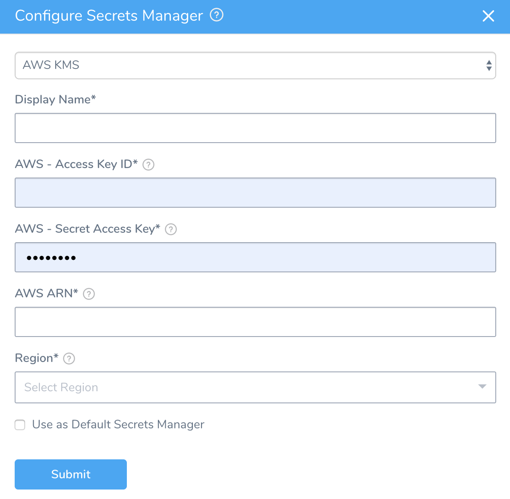

Harness includes a built-in Secrets Management feature that enables you to store encrypted secrets, such as access keys, and use them in your Harness applications.

In this topic:

* [Before You Begin](#before_you_begin)
* [Step 1: Configure Secrets Manager](#step_1_configure_secrets_manager)
* [Where is the Secret for the Secret Manager Stored?](#where_is_the_secret_for_the_secret_manager_stored)
* [Next Steps](#next_steps)

Looking for specific secrets managers? See:

* [Add a Google Cloud KMS Secrets Manager](add-a-google-cloud-kms-secrets-manager.md)
* [Add a Google Cloud Secrets Manager](add-a-google-cloud-secrets-manager.md)
* [Add an AWS Secrets Manager](add-an-aws-secrets-manager.md)
* [Add an AWS KMS Secrets Manager](add-an-aws-kms-secrets-manager.md)
* [Add a HashiCorp Vault Secrets Manager](add-a-hashi-corp-vault-secrets-manager.md)
* [Add an Azure Key Vault Secrets Manager](azure-key-vault.md)

### Before You Begin

* See [Harness Key Concepts](https://docs.harness.io/article/4o7oqwih6h-harness-key-concepts).
* See [Secrets Management Overview](secret-management.md).

### Step 1: Configure Secrets Manager

1. Select **Security** > **Secrets Management**. The **Secrets Management** page appears.
2. Click **Configure Secrets Managers**. In the resulting **Secrets Managers** page, the **Status** column indicates the **Default** provider.

3. Click **Add Secrets Manager**. The **Configure Secrets Manager** dialog appears.

4. Provide the account access information for the new secrets manager.
5. If you choose to set this secrets manager as the default, select **Use as Default Secrets Manager**.
6. For **Usage Scope**, see [Scope Secret Managers to Applications and Environments](scope-secret-managers-to-applications-and-environments.md).
7. Click **Submit**.

When a new Default Secrets Manager is set up, only new Cloud Provider and/Connector secret fields are encrypted and stored in the new Default Secrets Manager. Existing Cloud Providers and Connectors created before the change are unaffected.

### Where is the Secret for the Secret Manager Stored?

Harness stores all your secrets in your Secret Manager.

The secret you use to connect Harness to your Secrets Manager (password, etc), is stored in the Harness Default Secret Manager.

### Next Steps

* Adding Secret Managers
	+ [Add a Google Cloud KMS Secrets Manager](add-a-google-cloud-kms-secrets-manager.md)
	+ [Add an AWS Secrets Manager](add-an-aws-secrets-manager.md)
	+ [Add an AWS KMS Secrets Manager](add-an-aws-kms-secrets-manager.md)
	+ [Add a HashiCorp Vault Secrets Manager](add-a-hashi-corp-vault-secrets-manager.md)
	+ [Add an Azure Key Vault Secrets Manager](azure-key-vault.md)
* Managing Secrets
	+ [Scope Secret Managers to Applications and Environments](scope-secret-managers-to-applications-and-environments.md)
	+ [Restrict Secrets Usage](restrict-secrets-usage.md)
	+ [Use Encrypted Text Secrets](use-encrypted-text-secrets.md)
	+ [Use Encrypted File Secrets](use-encrypted-file-secrets.md)
	+ [Migrate Secrets between Secrets Managers](migrate-secrets-between-secrets-managers.md)
	+ [Restrict Secrets Usage](restrict-secrets-usage.md)
	+ [Reference Existing Secrets](reference-existing-secrets.md)
	+ [Use Secrets in a Delegate Profile](../../account/manage-delegates/use-a-secret-in-a-delegate-profile.md)

