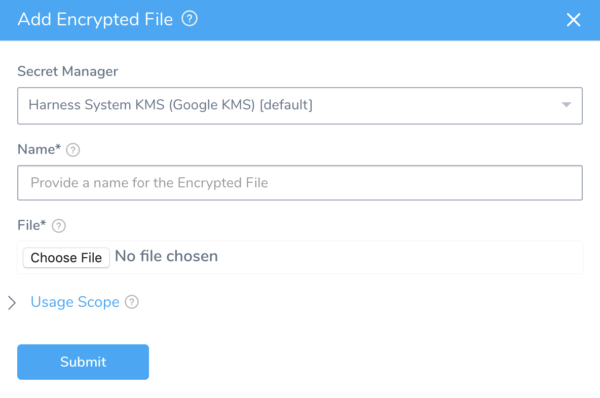
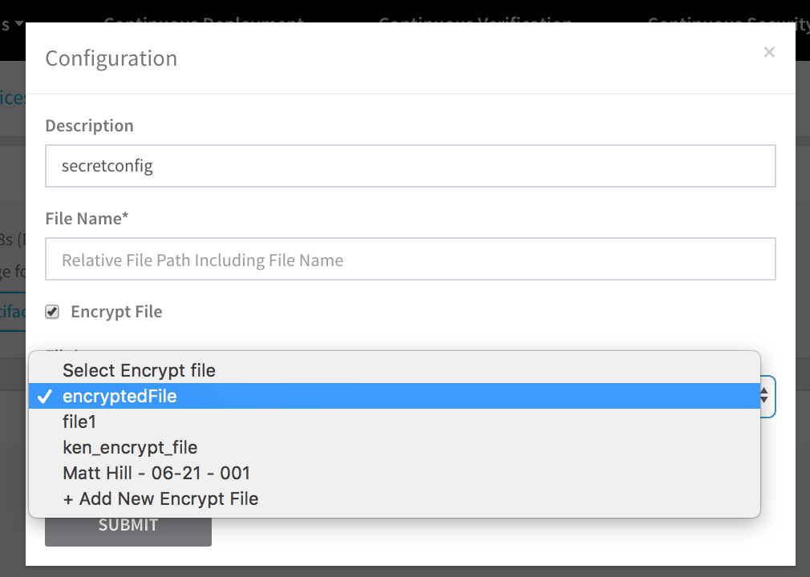

You can upload encrypted files and reference them across your account in the same way as encrypted text.

In this topic:

* [Before You Begin](use-encrypted-file-secrets.md#before-you-begin)
* [Step 1: Add Encrypted File](use-encrypted-file-secrets.md#step-1-add-encrypted-file)
* [Step 2: Reference the Encrypted File](use-encrypted-file-secrets.md#step-2-reference-the-encrypted-file)
* [Review: Encrypted Files Must be Added to a Service](#review_encrypted_files_must_be_added_to_a_service)
* [Review: File Secrets in Outputs](use-encrypted-file-secrets.md#review-file-secrets-in-outputs)

### Before You Begin

* See [Harness Key Concepts](https://docs.harness.io/article/4o7oqwih6h-harness-key-concepts).
* Make sure you add the required Secrets Manager. See [Add a Secrets Manager](add-a-secrets-manager.md).

### Step 1: Add Encrypted File

1. In **Secrets Management**, click **Encrypted Files**.
2. Click **Add Encrypted File**. The **Add Encrypted File** dialog appears.

3. Select the secrets manager you will use to encrypt this file.
4. Enter a name for the encrypted file. This is the name you will use to reference the file in application entities.
5. Click **Choose File**, and locate and add a file. The default Secrets Manager for your account is used to encrypt the file.
6. **Scope to Account** - If your Harness User account is part of a User Group with the **Administer Other Account Functions** permission enabled, you will see the **Scope to Account** option. Select **Scope to Account** to make this encrypted file secret available to Delegate Profile scripts only. Only secrets scoped to the account are available to use in Delegate Profiles.
7. For **Usage Scope**, see [Restrict Secrets Usage](restrict-secrets-usage.md).
8. Click **SUBMIT**.

### Step 2: Reference the Encrypted File

When you are in an application entity that uses files, you can reference the encrypted file.

For example, in the following **Configuration File** dialog, click **Encrypt File** and the **File** dropdown lets you choose the file you added in **Secrets Management**:




### Review: Encrypted Files Must be Added to a Service

To use Encrypted Files, you must add them to a Service. 

You can then use the Encrypted File in any Workflow that deploys that Service using the variables:

* `${configFile.getAsBase64("secret_name")}` — This displays the contents of the file encoded in Base64 binary-to-text encoding schemes.
* `${configFile.getAsString("secret_name")}` — This displays the contents of the file as a string.

Let's look at each example.

#### File Secret with Base64 Encoding

First, we have a Harness Service where the file secret is added to Config Files with the name **secret-file**.

The contents of the file is `this is a file secret`.

In a Workflow that uses the Service, add a Shell Script step such as the following:


```
cat <<EOF  
file secret:  
${configFile.getAsBase64("secret-file")}  
EOF
```
When you deploy the Workflow, the script is executed and the file contents are Base64 encoded:


```
Executing command ...  
file secret:  
dGhpcyBpcyBhIGZpbGUgc2VjcmV0Cgo=  
Command completed with ExitCode (0)
```
#### File Secret as String

Let's add a new Shell Script step using `${configFile.getAsString("secret_name")}`:


```
cat <<EOF  
file secret:  
${configFile.getAsString("secret-file")}  
EOF
```
When you deploy the Workflow, the script is executed and the file contents are string encoded:


```
Executing command ...  
file secret:  
this is a file secret  
  
Command completed with ExitCode (0)
```
For information on adding Encrypted Files to a Service, see [Config Files](../../../continuous-delivery/model-cd-pipeline/setup-services/service-configuration.md#config-files).

#### Do Not Echo File Secrets

Echo does not work with file secrets. For example, if your file secret contained the following:


```
a  
b  
c
```
and you used echo like this:


```
echo "file secret: " ${configFile.getAsString("secret-file")}
```
The output would be:


```
file secret: a  
command not found: b  
command not found: c
```
Instead, use cat like this:


```
cat <<EOF  
file secret:  
${configFile.getAsBase64("secret-file")}  
EOF
```
### Review: File Secrets in Outputs

File secrets are not masked in Harness logs. As noted above they can be encoded in different formats, but they are not masked from users.

See [Secrets and Log Sanitization](../../techref-category/techref-security/secrets-and-log-sanitization.md).

