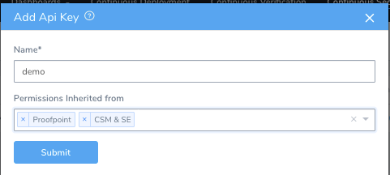
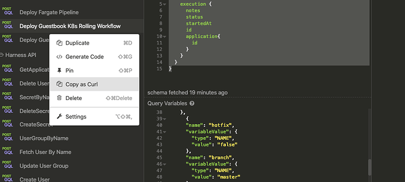

This topic describes how to start executions using the `StartExecution` Harness API.

You can start a Workflow and a Pipeline using APIs. For more information, see [Trigger Workflows or Pipelines Using GraphQL API](trigger-workflow-or-a-pipeline-using-api.md) and [Harness Blog Post](https://community.harness.io/t/deployment-api-is-live/419). The API access is tied to an [API Key](../../security/access-management-howtos/api-keys.md) created in the Access Management section in Continuous Security.

### Use Cases

* Incorporate an API call in your Jenkins or another system to fire off the deployment (system to system interaction)
* Create your own in-house CLI tool to trigger deployments
* Start an execution using GraphQL queries via Harness API Explorer

### Authentication

You can authenticate using **Logged-in User Session** or **Use API Key.** The authentication determines what data you can query and retrieve via API. By default, when you launch the **API Explorer**, you authenticate using a session key.

For more information, see [Authenticate](harness-api-explorer.md#step-1-authenticate).

### Authorization

The API authorization uses the API Token. The API token can be scoped to a Harness user group or multiple user groups.

For list APIs, the data is returned based on your permissions. You are only allowed to see what your user group is authorized to read and have access to.

#### Example

Add an API key scoped to two different permission groups:

Below, the user can see the key with the **Permissions Inherited from** field:

The permissions for these groups are tied to the token. The user or system that uses the token will only be authorized to perform the specific actions.

These user groups do not have permissions to execute a production Pipeline. When deploying the Pipeline with the key, the API throws an error stating that the user is not authorized to deploy.


#### Note

* The authorization and authentication of the API don’t apply to any specific portion, the entire API follows this model.
* Admins can rotate the API keys to avoid them being stale. To rotate, simply delete the old API key and create a new one.

### Sample Queries

Here are the sample queries:

#### Get Pipelines By Name

This sample query returns Pipeline name and the variables associated with it.

##### Request


```
{  
  pipelineByName(applicationId: "iIfYmHDqTj6Gsygtwt4VRQ", pipelineName: "Guestbook Pipeline") {  
    id  
    name  
    pipelineVariables {  
      name  
      type  
      required  
    }  
  }  
}
```
##### Response


```
{  
  "data": {  
    "pipelineByName": {  
      "id": "YdK1ONo9TnyzIK5-plsnAg",  
      "name": "Guestbook Pipeline",  
      "pipelineVariables": [  
        {  
          "name": "skipCV",  
          "type": "Text",  
          "required": false  
        },  
        {  
          "name": "hotfix",  
          "type": "Text",  
          "required": false  
        },  
        {  
          "name": "branch",  
          "type": "Text",  
          "required": false  
        }  
      ]  
    }  
  }  
}
```
#### Get Workflow By Name

This sample query returns Workflow name and the variables associated with it.

##### Request


```
{  
  workflowByName(applicationId: "iIfYmHDqTj6Gsygtwt4VRQ", workflowName: "K8s Rolling Deployment") {  
    id  
    name  
    workflowVariables {  
      name  
      type  
      required  
    }  
  }  
}  

```
##### Response


```
{  
  "data": {  
    "workflowByName": {  
      "id": "VzViT24gTluKWNFpdrL95A",  
      "name": "K8s Rolling Deployment",  
      "workflowVariables": [  
        {  
          "name": "Environment",  
          "type": "Environment",  
          "required": true  
        },  
        {  
          "name": "Service",  
          "type": "Service",  
          "required": true  
        },  
        {  
          "name": "InfraDefinition_KUBERNETES",  
          "type": "Infrastructure definition",  
          "required": true  
        },  
        {  
          "name": "hotfix",  
          "type": "Text",  
          "required": false  
        },  
        {  
          "name": "branch",  
          "type": "Text",  
          "required": false  
        },  
        {  
          "name": "skipCV",  
          "type": "Text",  
          "required": false  
        }  
      ]  
    }  
  }  
}
```
### Deploy Fargate Production Pipeline

This example has no Workflow variables, just a plain deployment.

First query by the Application name to retrieve the Application ID and PipelineID.


```
query {  
  applicationByName(name:"Harness Demo"){  
    id  
    name  
    pipelines(limit:4){  
      nodes{  
        id  
        description  
      }  
    }  
  }  
}
```
After getting the information, create `startExecution` mutation to execute the deployment.

You need to pass the Application ID and Pipeline ID as an input. Based on your mutation, the notes, execution ID, and Application ID are returned.


```
startExecution (input:$startExecution){  
    clientMutationId  
    execution {  
      notes  
      id  
      application{  
        id  
      }  
    }  
  }  
}
```
**Request**

For the parameters to execute the query, pass the below information:


```
{  
  "startExecution": {  
    "applicationId": "<YOUR APPLICATION ID>",  
    "notes": "Demo",  
    "executionType": "PIPELINE",  
    "entityId": "<YOUR PIPELINE ID>",  
    "serviceInputs": {  
      "name": "fargate-nginx",  
      "artifactValueInput": {  
        "buildNumber": {  
          "buildNumber": "1.10.1",  
          "artifactSourceName": "library_nginx"  
        },  
        "valueType": "BUILD_NUMBER"  
        }  
    }  
    }  
}
```
**Response**

Payload and the Pipeline executed are returned.


```
{  
  "data": {  
    "startExecution": {  
      "clientMutationId": null,  
      "execution": {  
        "notes": "Demo",  
        "id": "<YOUR EXECUTION ID>",  
        "application": {  
          "id": "<YOUR APPLICATION ID>"  
        }  
      }  
    }  
  }  
}
```
You can also see your deployment in the Continuous Deployment page.


### Deploy a Pipeline with Variables

The below sample shows how to deploy a Pipeline with variables.

##### Query


```
mutation($startExecution: StartExecutionInput!){  
  startExecution (input:$startExecution){  
    clientMutationId  
    execution {  
      notes  
      status  
      startedAt  
      id  
      application{  
        id  
      }  
    }  
  }  
}
```
##### Query with Variables


```
{  
   "name":"skipCV",  
   "variableValue":{  
      "type":"NAME",  
      "value":"true"  
   }  
},  
{  
   "name":"branch",  
   "variableValue":{  
      "value":"master",  
      "type":"NAME"  
   }  
},  
{  
   "name":"hotfix",  
   "variableValue":{  
      "value":"false",  
      "type":"NAME"  
   }  
         }  
      ]  
   }  
}
```
Proof that the Workflow variables are passed:

**Branch**

**H****ot fix**

Since it was set to false all the stages are deployed.

**skipCV**

The end result:


### Deploy a Workflow with Variables

The following sample shows how to deploy a Workflow with variables.

##### Query for the Execution


```
mutation ($startExecution: StartExecutionInput!) {  
  startExecution(input: $startExecution) {  
    clientMutationId  
    execution {  
      notes  
      status  
      startedAt  
      id  
      application {  
        id  
      }  
    }  
  }  
}
```
##### Query Variables


```
{  
   "startExecution":{  
      "applicationId":"iIfYmHDqTj6Gsygtwt4VRQ",  
      "notes":"Demo",  
      "executionType":"WORKFLOW",  
      "entityId":"VzViT24gTluKWNFpdrL95A",  
      "serviceInputs":{  
         "name":"guestbook",  
         "artifactValueInput":{  
            "buildNumber":{  
               "buildNumber":"v6",  
               "artifactSourceName":"guestbook"  
            },  
            "valueType":"BUILD_NUMBER"  
         }  
      },  
      "variableInputs":[  
         {  
            "name":"Environment",  
            "variableValue":{  
               "type":"NAME",  
               "value":"dev"  
            }  
         },  
         {  
            "name":"InfraDefinition_KUBERNETES",  
            "variableValue":{  
               "type":"NAME",  
               "value":"k8s-dev"  
            }  
         },  
         {  
            "name":"Service",  
            "variableValue":{  
               "type":"NAME",  
               "value":"guestbook"  
            }  
         },  
         {  
            "name":"hotfix",  
            "variableValue":{  
               "type":"NAME",  
               "value":"false"  
            },  
            "name":"branch",  
            "variableValue":{  
               "type":"NAME",  
               "value":"master"  
            },  
            "name":"skipCV",  
            "variableValue":{  
               "type":"NAME",  
               "value":"true"  
            }  
         }  
      ]  
   }  
}  

```
**Proof of Execution**

The value was **master** for **branch**. The **branch** is successfully passed:

The Prometheus step is skipped due to the set condition. **skipCV** was set to **true**.


### Check the Status of Deployments Via API

You can use the following queries to check the deployment status.

#### For Pipeline Execution


```
query{  
  execution(executionId: "QzhqUddfQiKMxJdEzZC3bg") {  
    id  
    ... on PipelineExecution {  
      id  
      status  
    }  
  }  
}  

```
#### For Workflow Execution


```
{  
  execution(executionId:"_Mffj1GZQd-VgNN_XWA7NQ"){  
    id  
    status  
    ... on WorkflowExecution {  
      id  
      outcomes{  
        nodes{  
          execution {  
            id  
            endedAt  
            startedAt  
          }  
        }  
      }  
    }  
  }  
}
```
### Scripts for CLI Tools or System to System Interaction

Here is a sample script with the `startExecution` API call:


```
#ARGUMENTS  
APPLICATIONID="<YOUR APPLICATION ID>"  
PIPELINEID="<YOUR PIPELINE ID>"  
BUILDNO="<YOUR BUILD NO>"  
SERVICENAME="<YOUR SERVICE NAME>"  
ARTIFACTSOURCENAME="<YOUR ARTIFACT SOURCE>"  
# Execute Pipeline  
func_execute_pipeline(){  
	curl --request POST \  
	  --url 'https://app.harness.io/gateway/api/graphql?accountId='$HARNESS_ACCOUNT_ID'' \  
	  --header 'content-type: application/json' \  
	  --header 'x-api-key:'$HARNESS_KEY' \  
	  --data '{"query":"\nmutation($startExecution: StartExecutionInput!){\n  startExecution (input:$startExecution){\n    clientMutationId\n    execution {\n      notes\n      id\n      application{\n        id\n      }\n    }\n  }\n}","variables":{"startExecution":{"applicationId":"'$APPLICATIONID'","notes":"Demo","executionType":"PIPELINE","entityId":"'$PIPELINEID'","serviceInputs":{"name":"'$SERVICENAME'","artifactValueInput":{"buildNumber":{"buildNumber":"'$BUILDNO'","artifactSourceName":"'$ARTIFACTSOURCENAME'"},"valueType":"BUILD_NUMBER"}}}}}'  
}
```
Here is a sample script for `Get Application By Name`:


```
# Get Application By Name  
APPNAME="<YOUR APP NAME>"  
func_getAppByName(){  
curl --request POST \  
  --url 'https://app.harness.io/gateway/api/graphql?accountId='$HARNESS_ACCOUNT_ID'' \  
  --header 'content-type: application/json' \  
  --header 'x-api-key:'$HARNESS_KEY' \  
  --data '{"query":"query {\n  applicationByName(name:\"'$APPNAME'\"){\n    id\n    name\n    pipelines(limit:4){\n      nodes{\n        id\n        description\n      }\n    }\n  }\n}\n\n"}'  
}  

```
You can use tools like [Insomnia](https://insomnia.rest/download/#mac) or [Postman](https://www.postman.com/downloads/) to generate these CURL commands. Here, Insomnia is used.

1. Click on the **Arrow** key next to your command and select from the drop-down list.
2. Click **Copy as Curl** and it's copied to your clipboard.
3. Paste the command.  
  

```
curl --request POST \  
  --url 'https://app.harness.io/gateway/api/graphql?accountId=<ACOUNTID> \  
  --header 'content-type: application/json' \  
  --header 'x-api-key: <API_KEY>' \  
  --data '{"query":"\nmutation($startExecution: StartExecutionInput!){\n  startExecution (input:$startExecution){\n    clientMutationId\n    execution {\n      notes\n      status\n      startedAt\n      id\n      application{\n        id\n      }\n    }\n  }\n}","variables":{"startExecution":{"applicationId":"iIfYmHDqTj6Gsygtwt4VRQ","notes":"Demo","executionType":"WORKFLOW","entityId":"VzViT24gTluKWNFpdrL95A","serviceInputs":{"name":"guestbook","artifactValueInput":{"buildNumber":{"buildNumber":"v6","artifactSourceName":"guestbook"},"valueType":"BUILD_NUMBER"}},"variableInputs":[{"name":"Environment","variableValue":{"type":"NAME","value":"dev"}},{"name":"InfraDefinition_KUBERNETES","variableValue":{"type":"NAME","value":"k8s-dev"}},{"name":"Service","variableValue":{"type":"NAME","value":"guestbook"}},{"name":"skipCV","variableValue":{"type":"NAME","value":"true"}}]}}}'  

```

