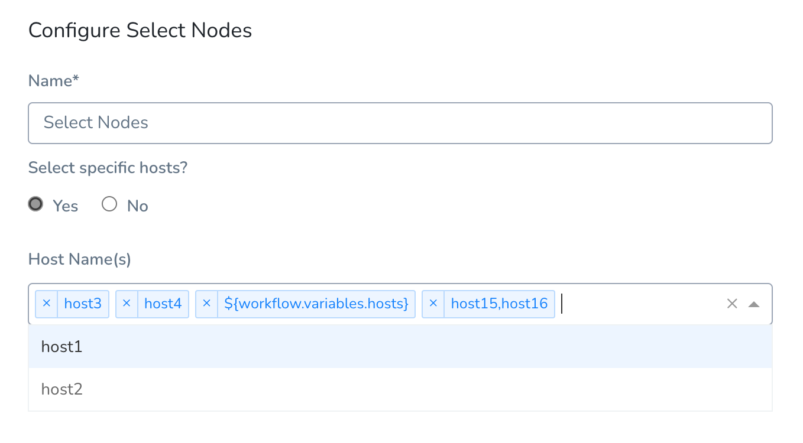
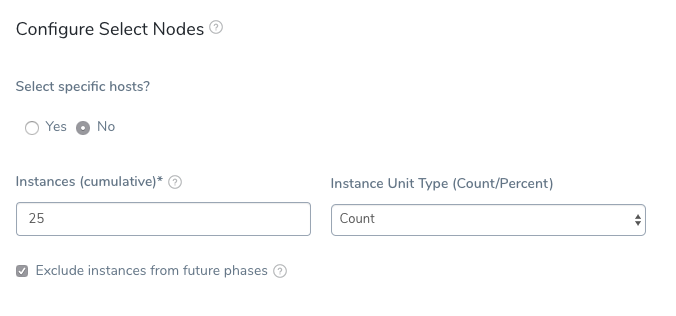

The Select Nodes step selects the target hosts from the [Infrastructure Definition](../../../../continuous-delivery/model-cd-pipeline/environments/infrastructure-definitions.md) you defined. You can choose to select a specific host or simply specify the number of instances to select with the Infrastructure Definition criteria.

The Select Nodes step is used before the [Install step](install-workflow-step.md), which installs the application on the hosts or instances you selected.

You cannot use [Harness expressions](../../variables/variables.md) as parameters in the Select Nodes step.

### Limitation

Use the **Select Nodes** step once per phase only. You cannot use **Select Nodes** more than once per phase.

### Select Specific Hosts

If you want to enter the specific hosts on which to deploy, select **Yes**.

If you want Harness to select the hosts using your Infrastructure Definition, and for you to set the number of instances, select **No**.

### Host Names

If you choose **Yes** in **Select specific hosts?**, click in **Host Name(s)** to select the specific target hosts for the deployment. Harness will obtain the host names or hosts that match the criteria of your Infrastructure Definition.

The following image shows an **Infrastructure Definition** specifying an AWS Region, VPC, and Tags (**Name:doc-target**), the EC2 instance that meets that criteria, and the host name in the Node Select dialog.

### Option: Select Host Not in Infrastructure Definition

Currently, this feature is behind the feature flag `DEPLOY_TO_INLINE_HOSTS` and available in SSH and WinRM deployments only. Contact [Harness Support](mailto:support@harness.io) to enable the feature.The nodes that appear in the Select Nodes **Host Name(s)** setting are taken from the Workflow's Infrastructure Definition, but you can enter in alternate or additional nodes. 

In the following example, host1 and host2 are from the Workflow's Infrastructure Definition, and the remaining hosts are entered manually.

You can also enter [Workflow variable expressions](../../../../continuous-delivery/model-cd-pipeline/workflows/add-workflow-variables-new-template.md) that are resolved at runtime. The Workflow variables can be a list of hosts.

### Instances

In **Instances**, enter the number of instances to use. Remember that Harness is deploying to *existing* instances as defined in your Infrastructure Definition. Ensure that there are enough instances that meet your criteria.

### Instance Unit Type

Select Count or Percentage.

### Exclude instances from future phases

When the **Exclude instances from future phases** setting is selected (recommended), the instance(s) selected by this **Node Select** step will not be eligible for selection by any future **Node Select** step.

In cases where you want to perform a one-time operation using a node and then deploy to all nodes in later phases, you might want to leave **Exclude instances from future phases** unselected.

### Select Nodes and Canary Deployments

While this topic discusses a Basic Workflow deployment, **Select Nodes** can be used in a Canary Workflow deployment also.

In a Canary Workflow deployment for an SSH Service, you use multiple Phases, each with a **Node Select** step to deploy to a percentage of target hosts:

1. Phase 1: Node Select: Instances: 25%
2. Phase 2: Node Select: Instances: 50%
3. Phase 3: Node Select: Instances: 75%
4. Phase 4: Node Select: Instances: 100%

Node Select will look like this in Phase 1:

And like this in Phase 2:

The **Instances** setting is cumulative not additive. So using 25% at each phase will not equal 100%. Each successive **Node Select** incorporates all **Node Select** **Instances** settings before it. To reach 100%, your **Instances** setting at each phase must include the previous percentage (25%, 50%, 75%, 100%).

The same is true for using Count instead of Percentage. If you use multiple **Node Select** steps in multiple Workflow phases (as in a Canary Workflow) using 1 Count at each of 4 phases will not equal 4 instances. Each successive **Node Select** incorporates all **Node Select** **Instances** settings before it. To reach 4 instances, your **Instances** setting at each phase must include the previous count (1, 2, 3, 4).

When the **Exclude instances from future phases** setting is selected (recommended for Canary deployments), the instance(s) selected by this **Node Select** step will not be eligible for selection by any future **Node Select** step.### See Also

* [Install Workflow Step](install-workflow-step.md)
* [Traditional Deployments Overview](../../../../continuous-delivery/traditional-deployments/traditional-deployments-overview.md)

