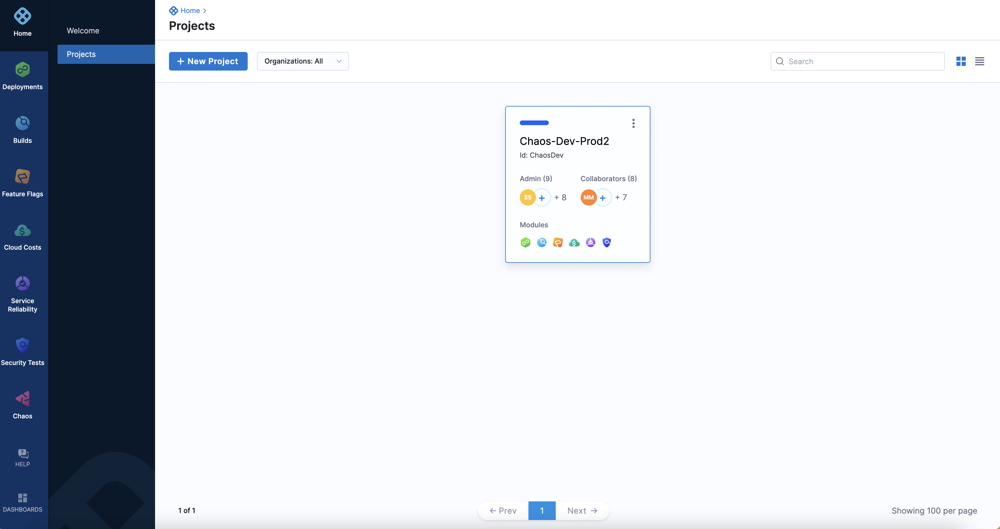
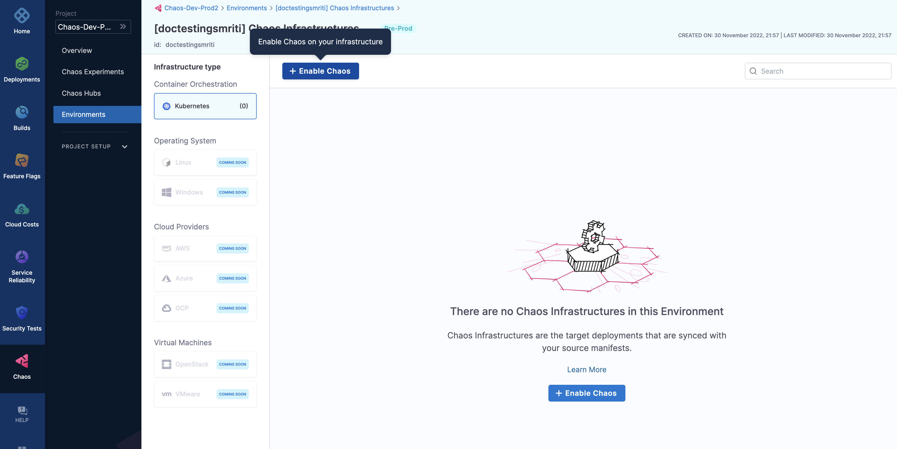
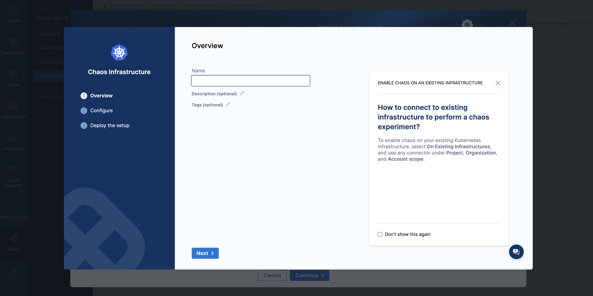
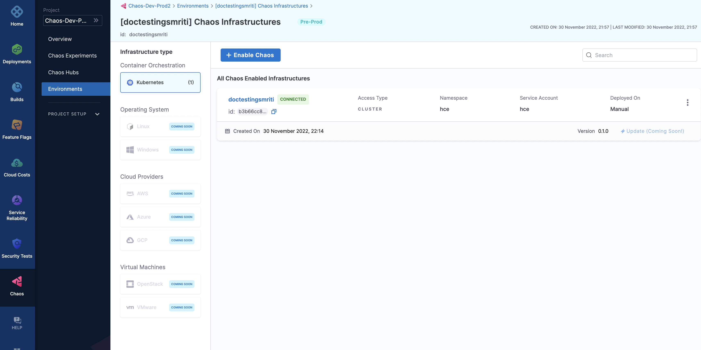
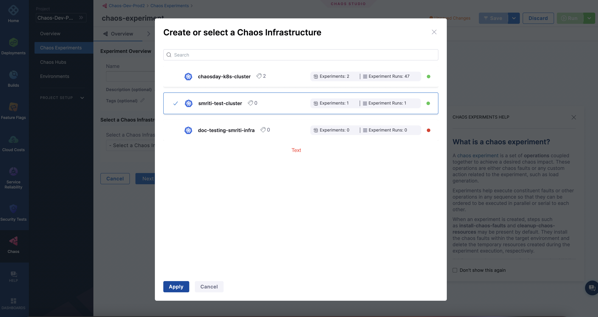
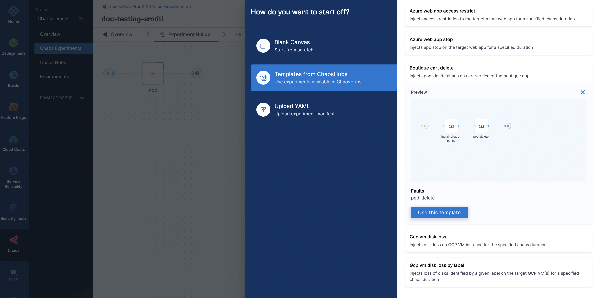
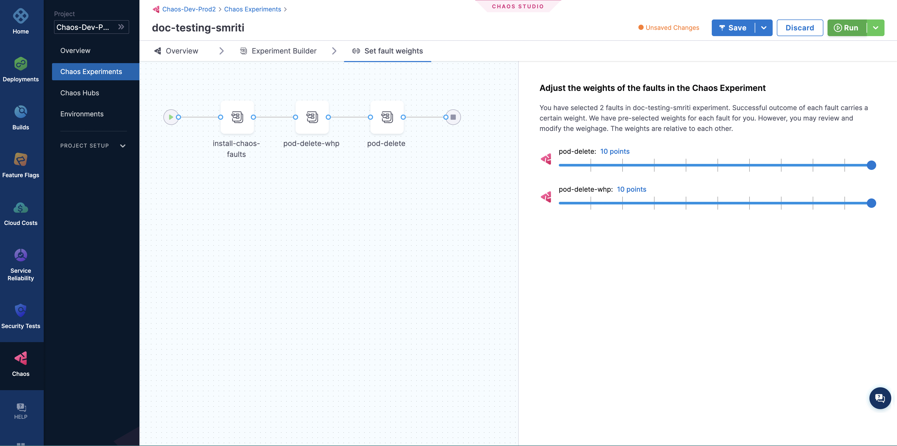
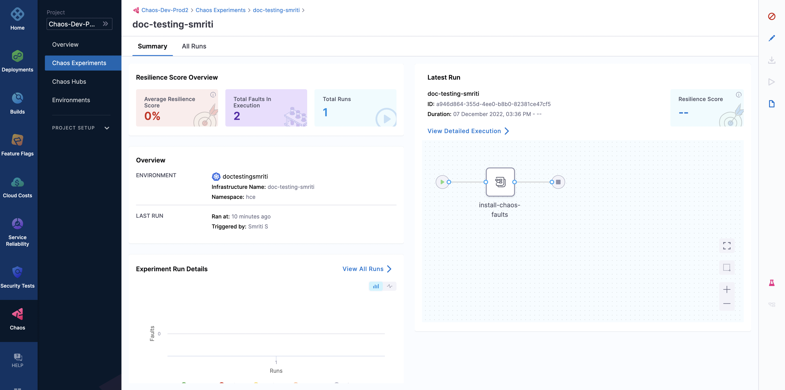
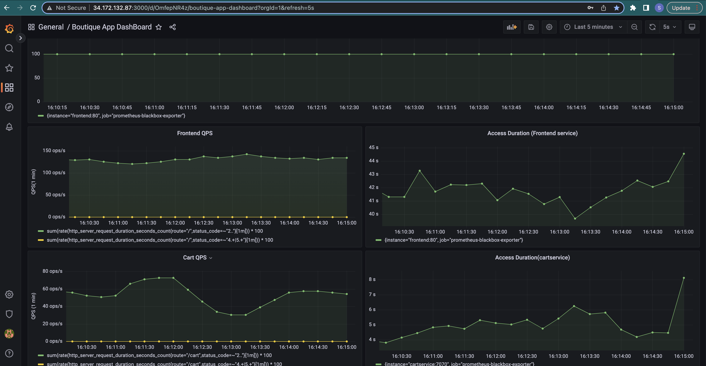

## Objective
To introduce chaos in an online boutique application and determine the resilience score to understand how the application performs when a Kubernetes pod is deleted. By the end of this tutorial, you will be familiar with the concept of using the chaos access center to create environment, infrastructure and enabling chaos on such a chaos infrastructure. You will have an understanding of introducing chaos into an application and observing the actions that take place which determine how resilient the application is, to unforeseen failures.   

## Permissions to work through this tutorial
1. Permissions to create a cluster (so that you can create the namespace, resources, etc.)
2. Invite/sign up to prod2/qa
3. ‘kubectl’ command-line tool
4. Access to create environment in the project
5. Access to create Chaos infrastructure
6. Access to hce-play GCP


> **_Note:_** It is assumed that you have access to hce-play GCP and have already created a cluster.

## Next steps

1. Create an environment in the Chaos center, 
2. Create a chaos infrastructure inside that environment,
3. Set up an online boutique application that consists of microservices; and 
4. Introduce fault in the boutique application to induce chaos and determine the resilience score. 

### Create an Environment in the Chaos Center

1. Go to app.harness.io, and signup or contact Harness support to receive an invite to prod2 (or specify a different test environment). 



2. Go to ‘Chaos’, and click on the project you are given access to.


3. Click on ‘New Environment’ to create a new [chaos environment](https://developer.harness.io/docs/chaos-engineering/technical-reference/environments/).


#### Step 1: Specify the Name and Type of Environment
Specify the name of the environment, and the type of environment (production or non-production environment). Click on ‘Create’. 


This creates a new chaos environment, and automatically lands you inside your chaos environment. Your next step is to create a new chaos infrastructure.

> **_Note:_** You can also use a previously created chaos infrastructure. (Explain more about this)

### Create a Chaos Infrastructure

A [chaos infrastructure](https://developer.harness.io/docs/chaos-engineering/technical-reference/chaos-infrastructures) is basically a Kubernetes infrastructure that provides the necessary resources to execute your chaos experiment.

#### Step 1: Enable Chaos on a New Chaos Infrastructure

Click on ‘Enable Chaos’, and click on ‘Continue’.



#### Step 2: Specify the Name of the Chaos Infrastructure

Specify the ‘Name’ of the chaos infrastructure, and click on ‘Next’.



#### Step 3: Specify Other Parameters of the Chaos Infrastructure

Specify the ‘Installation mode’, ‘Chaos infrastructure namespace’, and ‘Service account name’.


#### Step 4: Download the YAML File To Deploy the Chaos Infrastructure

Click on ‘Next’ and download the YAML file that contains information to create the chaos infrastructure with the options you previously chose. Download this YAML file, and copy the command. Click on ‘Done’.


#### Step 5: Deploy the Chaos Infrastructure

Execute the command you just copied on your terminal. Ensure you are in the folder where this YAML file is present or specify the location of the YAML file. This YAML file creates the necessary configuration and environment required to set up your application and chaos access pods.
```
❯ kubectl apply -f <file-name.yaml>
```

```
namespace/hce created
serviceaccount/hce created
deployment.apps/chaos-operator-ce created
deployment.apps/chaos-exporter created
service/chaos-exporter created
customresourcedefinition.apiextensions.k8s.io/clusterworkflowtemplates.argoproj.io created
customresourcedefinition.apiextensions.k8s.io/cronworkflows.argoproj.io created
customresourcedefinition.apiextensions.k8s.io/workflows.argoproj.io created
customresourcedefinition.apiextensions.k8s.io/workflowtemplates.argoproj.io created
customresourcedefinition.apiextensions.k8s.io/workflowtasksets.argoproj.io created
customresourcedefinition.apiextensions.k8s.io/workflowtaskresults.argoproj.io created
customresourcedefinition.apiextensions.k8s.io/chaosengines.litmuschaos.io created
customresourcedefinition.apiextensions.k8s.io/chaosexperiments.litmuschaos.io created
customresourcedefinition.apiextensions.k8s.io/chaosresults.litmuschaos.io created
configmap/workflow-controller-configmap created
service/workflow-controller-metrics created
deployment.apps/workflow-controller created
configmap/subscriber-config created
secret/subscriber-secret created
deployment.apps/subscriber created
serviceaccount/litmus-cluster-scope created
clusterrole.rbac.authorization.k8s.io/litmus-cluster-scope created
clusterrolebinding.rbac.authorization.k8s.io/litmus-cluster-scope created
serviceaccount/litmus-admin created
clusterrole.rbac.authorization.k8s.io/litmus-admin created
clusterrolebinding.rbac.authorization.k8s.io/litmus-admin created
serviceaccount/argo-chaos created
clusterrole.rbac.authorization.k8s.io/chaos-cluster-role created
clusterrolebinding.rbac.authorization.k8s.io/chaos-cluster-role-binding created
clusterrole.rbac.authorization.k8s.io/subscriber-cluster-role created
clusterrolebinding.rbac.authorization.k8s.io/subscriber-cluster-role-binding created
serviceaccount/argo created
clusterrole.rbac.authorization.k8s.io/argo-cluster-role created
clusterrolebinding.rbac.authorization.k8s.io/argo-binding created
```

Once all the resources are created, your chaos infrastructure shows **`Connected`**. This indicates that your cluster is successfully connected to your chaos infrastructure. This may take about 2 to 4 minutes to connect.



**Congratulations! You just completed the first major step in running your own chaos experiment, which is creating and deploying a chaos infrastructure. The second and third prominent steps include configuring an application, and introducing fault inside the application, respectively.**

### Configure a Boutique Application

To configure an online boutique application, create a new namespace to house your application. 

#### Step 1: Execute the below command:
```
❯ kubectl create ns <namespace_name>
```

#### Step 2: Execute the following commands to set up your boutique application inside the previously created namespace. 
```
❯ kubectl apply -f https://raw.githubusercontent.com/Adarshkumar14/boutique-app-monitoring/main/manifest/app.yaml -n <namespace_name>
```

```
deployment.apps/emailservice created
service/emailservice created
deployment.apps/checkoutservice created
service/checkoutservice created
deployment.apps/recommendationservice created
service/recommendationservice created
deployment.apps/frontend created
service/frontend created
service/frontend-external created
deployment.apps/paymentservice created
service/paymentservice created
deployment.apps/productcatalogservice created
service/productcatalogservice created
deployment.apps/cartservice created
service/cartservice created
deployment.apps/loadgenerator created
deployment.apps/currencyservice created
service/currencyservice created
deployment.apps/shippingservice created
service/shippingservice created
deployment.apps/redis-cart created
service/redis-cart created
deployment.apps/adservice created
service/adservice created
```

and

```
❯ kubectl apply -f https://raw.githubusercontent.com/Adarshkumar14/boutique-app-monitoring/main/manifest/monitoring.yaml -n <namespace_name>
```

```
deployment.apps/emailservice created
service/emailservice created
deployment.apps/checkoutservice created
service/checkoutservice created
deployment.apps/recommendationservice created
service/recommendationservice created
deployment.apps/frontend created
service/frontend created
service/frontend-external created
deployment.apps/paymentservice created
service/paymentservice created
deployment.apps/productcatalogservice created
service/productcatalogservice created
deployment.apps/cartservice created
service/cartservice created
deployment.apps/loadgenerator created
deployment.apps/currencyservice created
service/currencyservice created
deployment.apps/shippingservice created
service/shippingservice created
deployment.apps/redis-cart created
service/redis-cart created
deployment.apps/adservice created
service/adservice created
smriti@Smriti S desktop % kubectl apply -f monitoring.yaml -n monitoring1
serviceaccount/prometheus created
role.rbac.authorization.k8s.io/prometheus created
rolebinding.rbac.authorization.k8s.io/prometheus created
configmap/prometheus-alertrules created
configmap/prometheus-configmap created
deployment.apps/prometheus-deployment created
service/prometheus-k8s created
configmap/prometheus-blackbox-exporter created
deployment.apps/prometheus-blackbox-exporter created
service/prometheus-blackbox-exporter created
configmap/litmus-grafana-provisioner created
configmap/litmus-grafana-dashboards created
configmap/litmus-grafana-datasources created
deployment.apps/grafana created
service/grafana created
```

**Congratulations! You just created an online boutique application with just two commands!**

#### Step 3: Verify the services created inside this namespace using the command

```
❯ kubectl get svc -n <namespace_name>
```

```
NAME                           TYPE           CLUSTER-IP    EXTERNAL-IP     PORT(S)          AGE
adservice                      ClusterIP      10.8.23.48    <none>          9555/TCP         92s
cartservice                    ClusterIP      10.8.20.159   <none>          7070/TCP         103s
checkoutservice                ClusterIP      10.8.24.94    <none>          5050/TCP         118s
currencyservice                ClusterIP      10.8.25.254   <none>          7000/TCP         100s
emailservice                   ClusterIP      10.8.25.97    <none>          5000/TCP         2m
frontend                       ClusterIP      10.8.20.227   <none>          80/TCP           112s
frontend-external              LoadBalancer   10.8.23.231   35.222.109.9    80:31998/TCP     111s
grafana                        LoadBalancer   10.8.26.152   34.172.132.87   3000:31288/TCP   53s
paymentservice                 ClusterIP      10.8.29.181   <none>          50051/TCP        109s
productcatalogservice          ClusterIP      10.8.26.0     <none>          3550/TCP         106s
prometheus-blackbox-exporter   ClusterIP      10.8.27.165   <none>          9115/TCP         58s
prometheus-k8s                 LoadBalancer   10.8.21.255   34.135.243.43   9090:32030/TCP   61s
recommendationservice          ClusterIP      10.8.24.34    <none>          8080/TCP         115s
redis-cart                     ClusterIP      10.8.25.135   <none>          6379/TCP         94s
shippingservice                ClusterIP      10.8.28.118   <none>          50051/TCP        97s
```

#### Step 4: Verify the pods running inside this namespace using the command

```
❯ kubectl get pods -n <namespace_name>
```

```
NAME                                            READY   STATUS    RESTARTS   AGE
adservice-56799c4499-xt8wv                      1/1     Running   0          4m16s
cartservice-ccdf9995f-4njx8                     1/1     Running   0          4m24s
checkoutservice-7547cff4bc-9mpwz                1/1     Running   0          4m34s
currencyservice-7f6c66bbc9-b7znp                1/1     Running   0          4m21s
emailservice-8549b46fd9-kqwdh                   1/1     Running   0          4m36s
frontend-77f8454f67-sb8xx                       1/1     Running   0          4m30s
grafana-58fcd9ccc7-2tcwz                        1/1     Running   0          67s
loadgenerator-77f7c4fbc8-smbzb                  1/1     Running   0          4m22s
paymentservice-6774649d9-xm2xt                  1/1     Running   0          4m27s
productcatalogservice-854596c6c7-r6f5b          1/1     Running   0          4m26s
prometheus-blackbox-exporter-79499f4f8b-kmv69   2/2     Running   0          73s
prometheus-deployment-5f74b545b8-mjqsv          1/1     Running   0          75s
recommendationservice-78866677f7-hxqtg          1/1     Running   0          4m32s
redis-cart-5cb9ccdf78-79gzk                     1/1     Running   0          4m18s
shippingservice-7ffd678887-4zt2b                1/1     Running   0          4m20s
```

The **last**, and **the most important** step of this experiment is injecting chaos into the application to determine the application's resilience to unforeseen failures. 

### Inject Chaos Into the Boutique Application

#### Step 1: Create a New Chaos Experiment

To inject chaos, navigate to your chaos access center, and click on 'Chaos Experiments'. Now click on ‘New experiment’.


#### Step 2: Specify the Parameters of the Chaos Experiment

Specify a name, and chaos infrastructure (that you have previously created).


#### Step 3: Apply the Chaos Infrastructure to the Experiment

Click on ‘Apply’ to apply the selected infrastructure to that experiment, and click on ‘Next’.



#### Step 4: Select the Template for the Experiment

To build an experiment, select 'Templates from ChaosHubs'.


#### Step 5: Use the Template

Select the 'Boutique cart delete’ option, and click on 'Use this template'.



#### Step 6: Select the Chaos Fault to Implement


#### Step 7: Specify parameters

Fill in the information required in the ‘Target application’ field, such as ‘Namespace’, ‘Kind’, and ‘Label’


#### Step 8: Set Fault Weights

Click on 'Set fault weights' on the screen.


#### Step 9: Save the Experiment

On the top right corner of your screen, click on 'Save'. This saves the experiment that you built.


#### Step 10: Run the Experiment

Click on the 'Run' button present at the top right corner, to run the experiment. This experiment runs for about 3 to 5 minutes during which it determines the **resilience score**.



#### Step 11: View Experiment Details

You can view the details of the experiment by clicking on 'Summary'.



### View the Online Boutique 

Access the '**external-ip**' of the '**frontend-external**' service. In our case, it is http://35.222.109.9/. 


### Visualize the Results of the Experiment

#### Step 1: Login to Grafana
You can login to Grafana by accessing the '**external-ip**' of **grafana**' service. In our case, it is http://34.172.132.87:3000. Specify the 'username' as 'admin', and 'password' as 'admin'.


#### Step 2: View the Boutique Dashboard

You can click on 'Boutique App Dashboard' to visualize the changes after chaos is injected into the application.


#### Step 3: Results before and after Chaos is Injected

Below is the visualization before chaos is injected into the application. 



